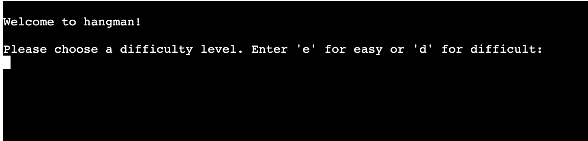
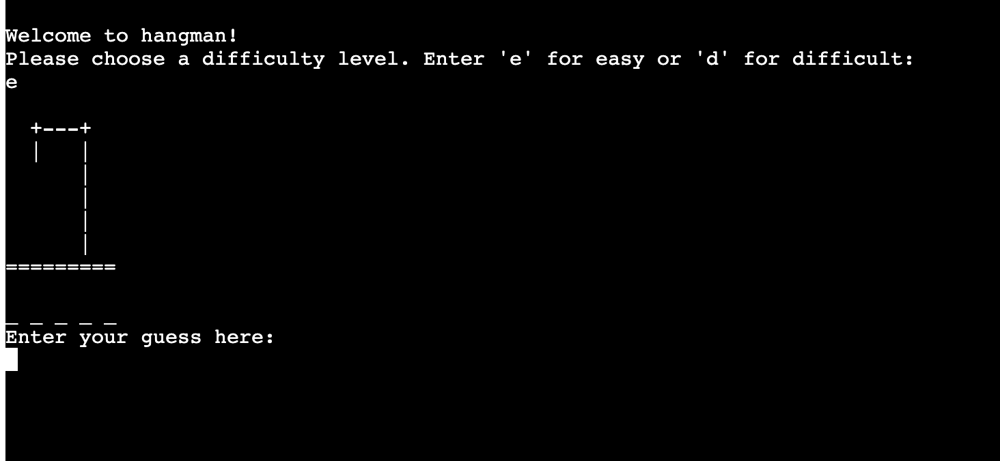

# Hangman

Hangman is a Python terminal game, which runs in the Code Institute mock terminal on Heroku.

Users can try to beat the computer by guessing letters in the randomly generated word, based on the number of letters in the word. Players have a limited number of wrong guesses they can make before the hangman Ascii diagram is complete, at which point the game ends.

[Here is the live version of my project.](https://hangman-rc.herokuapp.com/)

## How to play

Hangman is traditionally a paper and pencil guessing game for two or more players. You can read more about it on [Wikipedia](https://en.wikipedia.org/wiki/Hangman_(game)).

The player first selects their desired difficulty level - easy or difficult.

A random word is then generated from a list of words according to the level of diffuculty chosen. The initial hangman Ascii art image is displayed, along with an underscore for each letter in the answer.

The user is then prompted to input their letter guesses. Each time the player guesses, there is a message displayed confirming whether the letter is in the word or not. If the letter is in the word, the underscore is replaced by that letter. If the letter is not in the word, the hangman ascii art progresses to the next image in the series of images, i.e. another body part is added to the man. 

As guesses are made, they are displayed in a list on the terminal for the remainder of the game, so that the player can easily reference what has already been guessed, helping them to make their next guess.

The number of incorrect guesses that a user can make is limited to 5. Once 6 incorrect guesses are made, the hangman image shows the full man and the game is over. When the game is lost, the answer will also be revealed.

The game will also end when all letters of the answer have been guessed correctly.

## Features

### Existing features

* Game level selection

    * User selects from two game levels - easy or difficult:

    

* Random word generation

    * Word is randomly generated from a list of easy or difficult words, depending on the user's chosen level. The letters are displayed as underscores.

    

* Accepts user input

* Maintains scores

* End of game user message displayed based on score
    * If lost and only one correct guess away from winning: "Game over! You were so close though! Better luck next time :D"
    * Any other lost score: Game over! Better luck next time!"
    * If game won and the wrong_guess_count > 4: "Congratulations, you won! You were cutting it close though...you must need more practice :P" 
    * Any other winning score: "Congratulations, you won!"

* Input validation and error checking
    * You cannot input more than one letter at a time.
    * You can only enter non ascii lowercase letters, e.g. you cannot input a number.
    * If the same guess is entered twice, the list of guesses is not updated and no points are added to the correct or incorrect guess counts.
    * Empty spaces cannot be entered. 

## Data model

Tbc...

## Testing

I have manually tested this project throughout the development process by doing the following:

* Playing the game in the Gitpod terminal to help identify required game features to improve the player experience, such as a displayed list of guesses, and displaying the answer when the game is lost.
* Playing the game in the Heroku terminal to ensure it worked the same as in Gitpod, and to see what adjustments were needed for the final game layout.
* Gave invalid inputs to the game to ensure data validation was working as expected, e.g. words, numbers, Capital letters and empty spaces instead of lowercase single letters.
* Played the game to get a variety of different scores to ensure that the Hangman images were displayed correctly and that the correct conditional messages appear based on the score, e.g. "Game over! You were so close though! Better luck next time :D"
* Passed the code through a PEP8 linter and confirmed that there are no problems.

### Bugs

#### Solved bugs

* Capital letters in words from spredseet
* Enter e or d - updated or to and
* Blank spaces input resulted in a message confirming that "' ' is a letter in the word"

### Remaining bugs

* No bugs remaining.

### Validator testing

* PEP8 
    * No errors were returned from PEP8online.com

## Deployment

This project was deployed using the Code Institute's mock terminal for Heroku.

* Steps for deployment
    * Fork or clone this repository.
    * Create a new Heroku app.
    * Set the buildpacks to Python and Node.js in that order.
    * Link the Heroku app to the repository.
    * Click 'Deploy'.

## Credits

The Code Institute LMS content, including the The Love Sandwiches walkthrough project, as well as some posts on Stackoverflow were used to create this site. All code taken from these resources has been adapted to suit the needs of this site, except for the specific cases referenced below.

This [Stack Overflow](https://stackoverflow.com/questions/493386/how-to-print-without-a-newline-or-space) article was used for the code to print without adding a new line.

This [Python.org](https://docs.python.org/3/library/string.html) article was used to correct input errors for non-single lowercase letter inputs.

This [Geeks for Geeks.org](https://www.geeksforgeeks.org/clear-screen-python/) article for the code used to clear the terminal screen at different stages of the game.

[Wikipedia](https://en.wikipedia.org/wiki/Hangman_(game)) for the Hangman game description.

The Code Institue Heroku terminal.

## Acknowledgements

Thank you to my Mentor, Gerry McBride, for his help and guidance.

